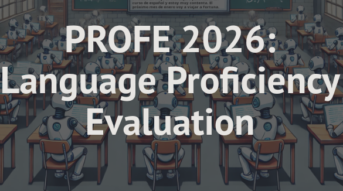

  

  I’m a Computer Scientist specialized in Artificial Intelligence, with a strong software engineering background and hands-on experience building AI systems.

  Curious about what I do? Have a look at my
  <a href="https://pfolgueira.vercel.app/">portfolio</a>,
  or find me on
  
  and
  .

## 🚀 Featured Projects

  <em>Some things I've built and worked on</em>

<table>
  <tr>
    <td align="center" width="33%">
      
        
      <strong>Zoology GraphRAG</strong>
       
      <em>Graph-based RAG system combining knowledge graphs, retrieval and AI agents.</em>
        
      <a href="https://github.com/pfolgueira/Zoology-GraphRAG">GitHub Repository ↗</a>
       
      <a href="https://zoology-graph-rag.vercel.app/">Live Demo ↗</a>
    </td><td align="center" width="33%">
  
    
  <strong>Reading Comprehension with LLMs</strong>
   
  <em>Automatic solving of Spanish reading-comprehension exams using LLMs.</em>
    
  <a href="https://github.com/NILGroup/TFM2526-ExamenesComprensionLectora">GitHub Repository ↗</a>
</td>

<td align="center" width="33%">
  
    
  <strong>Art-RAG</strong>
   
  <em>Multimodal semantic search system for artwork exploration.</em>
    
  <a href="https://github.com/pfolgueira/rag-multimodal-arte">GitHub Repository ↗</a>
   
  <a href="https://rag-multimodal-arte.vercel.app/">Live Demo ↗</a>
</td>

  </tr>
</table> 

  <em>Explore more projects in my repositories</em>
   
  ↓

## 📊 GitHub Stats

  

